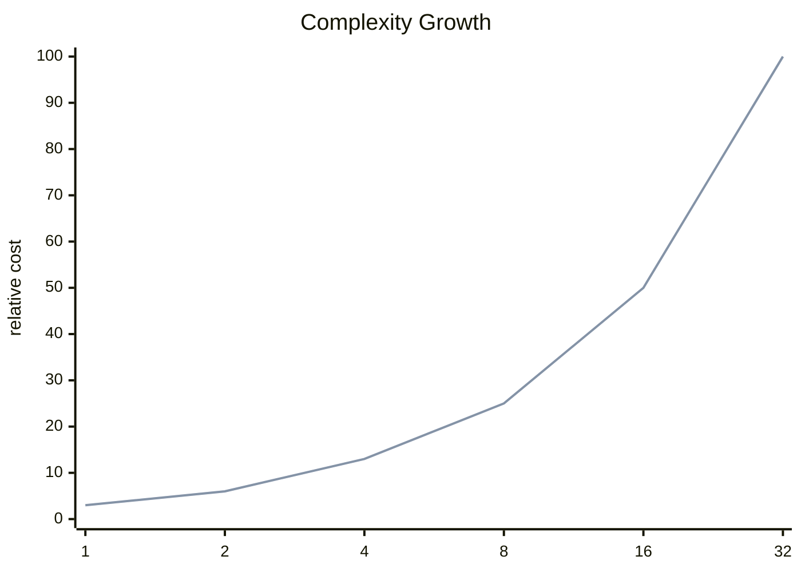

<h2><a href="https://leetcode.com/problems/two-sum-litcode-demo">Two Sum</a></h2> <hr><div align="center">

# Two Sum

<sub>A clean accepted solution with the key tradeoffs surfaced up front.</sub>

[](https://leetcode.com/problems/two-sum-litcode-demo)


</div>

## Snapshot

| Problem | Difficulty | Language | Runtime | Memory |
| --- | --- | --- | --- | --- |
| [Two Sum](https://leetcode.com/problems/two-sum-litcode-demo) | Easy | JavaScript | 2 ms | 43.1 MB |

## Intuition

> The solution follows the direct shape of the problem and keeps the implementation close to the required transformation.

## Approach

1. Read the relevant input state.
2. Apply the core transformation or lookup logic.
3. Return the result in the format expected by the judge.

## Execution Trace

The code moves from input inspection to the core transformation and returns as soon as the target condition is satisfied.

**Scenario:** Representative sample input

| Step | Action | State |
| --- | --- | --- |
| 1 | Read input | Initial state prepared |
| 2 | Apply core logic | State changes according to the submitted code |
| 3 | Return result | Output matches required format |

## Complexity

<sub>Normalized growth curve. Lower and flatter is better.</sub>



| Metric | Big-O | Tier |
| --- | --- | --- |
| **Time** | `O(n)` | Good |
| **Space** | `O(n)` | Good |

<details>
<summary>Complexity notes</summary>

| Metric | Explanation |
| --- | --- |
| **Time** | The submitted code appears to scan the input once. |
| **Space** | A hash-based structure can grow with the input. |

</details>

## Checks

- Smallest valid input
- Boundary values
- Inputs that trigger carry or empty-result behavior

<details>
<summary>Problem statement</summary>

## Problem Statement

Given an array of integers `nums` and an integer `target`, return indices of the two numbers such that they add up to target.

 You may assume that each input has exactly one solution, and you may not use the same element twice.

</details>

## Code

```js
function twoSum(nums, target) {
  const seen = new Map();

  for (let i = 0; i < nums.length; i++) {
    const needed = target - nums[i];
    if (seen.has(needed)) return [seen.get(needed), i];
    seen.set(nums[i], i);
  }

  return [];
}
```

---

<div align="center">
<sub>Generated by <strong>LitCode</strong></sub>
</div>
