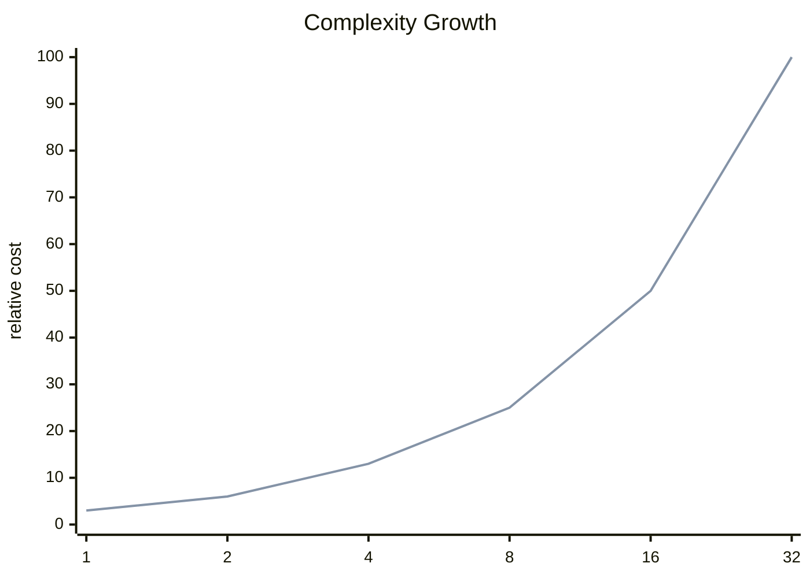

<h2><a href="https://leetcode.com/problems/lru-cache">LRU Cache</a></h2> <hr><div align="center">

# LRU Cache

<sub>A clean accepted solution with the key tradeoffs surfaced up front.</sub>

[](https://leetcode.com/problems/lru-cache)


</div>

## Snapshot

| Problem | Difficulty | Language | Runtime | Memory |
| --- | --- | --- | --- | --- |
| [LRU Cache](https://leetcode.com/problems/lru-cache) | Medium | Java | 49 ms | 131.2 MB |

## Intuition

> The solution follows the direct shape of the problem and keeps the implementation close to the required transformation.

## Approach

1. Read the relevant input state.
2. Apply the core transformation or lookup logic.
3. Return the result in the format expected by the judge.

## Execution Trace

The code moves from input inspection to the core transformation and returns as soon as the target condition is satisfied.

**Scenario:** Representative sample input

| Step | Action | State |
| --- | --- | --- |
| 1 | Read input | Initial state prepared |
| 2 | Apply core logic | State changes according to the submitted code |
| 3 | Return result | Output matches required format |

## Complexity

<sub>Normalized growth curve. Lower and flatter is better.</sub>



| Metric | Big-O | Tier |
| --- | --- | --- |
| **Time** | `O(n)` | Good |
| **Space** | `O(n)` | Good |

<details>
<summary>Complexity notes</summary>

| Metric | Explanation |
| --- | --- |
| **Time** | The submitted code appears to scan the input once. |
| **Space** | A hash-based structure can grow with the input. |

</details>

## Checks

- Smallest valid input
- Boundary values
- Inputs that trigger carry or empty-result behavior

<details>
<summary>Problem statement</summary>

## Problem Statement

Design a data structure that follows the constraints of a ** Least Recently Used (LRU) cache **.

 Implement the `LRUCache` class:

- `LRUCache(int capacity)` Initialize the LRU cache with **positive** size `capacity`.

- `int get(int key)` Return the value of the `key` if the key exists, otherwise return `-1`.

- `void put(int key, int value)` Update the value of the `key` if the `key` exists. Otherwise, add the `key-value` pair to the cache. If the number of keys exceeds the `capacity` from this operation, **evict** the least recently used key.

 The functions `get` and `put` must each run in `O(1)` average time complexity.

 Example 1:**

```text

**Input**
["LRUCache", "put", "put", "get", "put", "get", "put", "get", "get", "get"]
[[2], [1, 1], [2, 2], [1], [3, 3], [2], [4, 4], [1], [3], [4]]
**Output**
[null, null, null, 1, null, -1, null, -1, 3, 4]

**Explanation**
LRUCache lRUCache = new LRUCache(2);
lRUCache.put(1, 1); // cache is {1=1}
lRUCache.put(2, 2); // cache is {1=1, 2=2}
lRUCache.get(1); // return 1
lRUCache.put(3, 3); // LRU key was 2, evicts key 2, cache is {1=1, 3=3}
lRUCache.get(2); // returns -1 (not found)
lRUCache.put(4, 4); // LRU key was 1, evicts key 1, cache is {4=4, 3=3}
lRUCache.get(1); // return -1 (not found)
lRUCache.get(3); // return 3
lRUCache.get(4); // return 4

```

 **Constraints:**

- `1 4 `

- `0 5 `

- At most `2 * 10 5 ` calls will be made to `get` and `put`.

</details>

## Code

```java
import java.util.*;

class LRUCache {

    class Node {
        int key, val;
        Node prev, next;

        Node(int key, int val) {
            this.key = key;
            this.val = val;
        }
    }

    int capacity;
    Map<Integer, Node> map = new HashMap<>();
    Node head = new Node(-1, -1);
    Node tail = new Node(-1, -1);

    public LRUCache(int capacity) {
        this.capacity = capacity;
        map.clear();
        head.next = tail;
        tail.prev = head;
    }
    
    public int get(int key) {
        if (!map.containsKey(key)) return -1;

        Node node = map.get(key);
        deleteNode(node);
        insertAtHead(node);  

        return node.val;
    }
    
    public void put(int key, int value) {
        if (map.containsKey(key)) {
            Node node = map.get(key);
            node.val = value;
            deleteNode(node);
            insertAtHead(node);
        } else {
            if (map.size() == capacity) {
                Node node = tail.prev;
                map.remove(node.key);
                deleteNode(node);
            }

            Node node = new Node(key, value);
            map.put(node.key, node);
            insertAtHead(node);
        }
    }

    public void deleteNode(Node node) {
        node.prev.next = node.next;
        node.next.prev = node.prev;
    }

    public void insertAtHead(Node node) {
        Node next = head.next;

        head.next = node;
        node.prev = head;

        node.next = next;
        next.prev = node;
    }
}
/**
 * Your LRUCache object will be instantiated and called as such:
 * LRUCache obj = new LRUCache(capacity);
 * int param_1 = obj.get(key);
 * obj.put(key,value);
 */
```

---

<div align="center">
<sub>Generated by <strong>LitCode</strong></sub>
</div>
