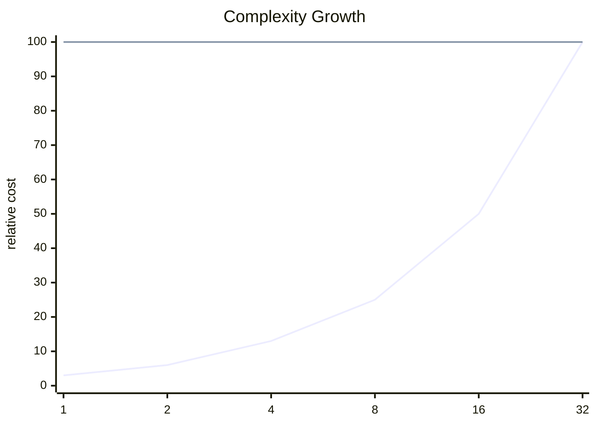

<h2><a href="https://leetcode.com/problems/min-stack">Min Stack</a></h2> <hr><div align="center">

# Min Stack

<sub>A clean accepted solution with the key tradeoffs surfaced up front.</sub>

[](https://leetcode.com/problems/min-stack)


</div>

## Snapshot

| Problem | Difficulty | Language | Runtime | Memory |
| --- | --- | --- | --- | --- |
| [Min Stack](https://leetcode.com/problems/min-stack) | Medium | Java | 5 ms | 47.1 MB |

## Intuition

> The solution follows the direct shape of the problem and keeps the implementation close to the required transformation.

## Approach

1. Read the relevant input state.
2. Apply the core transformation or lookup logic.
3. Return the result in the format expected by the judge.

## Execution Trace

The code moves from input inspection to the core transformation and returns as soon as the target condition is satisfied.

**Scenario:** Representative sample input

| Step | Action | State |
| --- | --- | --- |
| 1 | Read input | Initial state prepared |
| 2 | Apply core logic | State changes according to the submitted code |
| 3 | Return result | Output matches required format |

## Complexity

<sub>Normalized growth curve. Lower and flatter is better.</sub>



| Metric | Big-O | Tier |
| --- | --- | --- |
| **Time** | `O(n)` | Good |
| **Space** | `O(1)` | Excellent |

<details>
<summary>Complexity notes</summary>

| Metric | Explanation |
| --- | --- |
| **Time** | The submitted code appears to scan the input once. |
| **Space** | Only a constant amount of extra state is apparent from the submitted code. |

</details>

## Checks

- Smallest valid input
- Boundary values
- Inputs that trigger carry or empty-result behavior

<details>
<summary>Problem statement</summary>

## Problem Statement

Design a stack that supports push, pop, top, and retrieving the minimum element in constant time.

 Implement the `MinStack` class:

- `MinStack()` initializes the stack object.

- `void push(int val)` pushes the element `val` onto the stack.

- `void pop()` removes the element on the top of the stack.

- `int top()` gets the top element of the stack.

- `int getMin()` retrieves the minimum element in the stack.

 You must implement a solution with `O(1)` time complexity for each function.

 Example 1:**

```text

**Input**
["MinStack","push","push","push","getMin","pop","top","getMin"]
[[],[-2],[0],[-3],[],[],[],[]]

**Output**
[null,null,null,null,-3,null,0,-2]

**Explanation**
MinStack minStack = new MinStack();
minStack.push(-2);
minStack.push(0);
minStack.push(-3);
minStack.getMin(); // return -3
minStack.pop();
minStack.top(); // return 0
minStack.getMin(); // return -2

```

 **Constraints:**

- `-2 31 31 - 1`

- Methods `pop`, `top` and `getMin` operations will always be called on **non-empty** stacks.

- At most `3 * 10 4 ` calls will be made to `push`, `pop`, `top`, and `getMin`.

</details>

## Code

```java
class MinStack {
    Stack<Integer> stack;
    Stack<Integer> min;
    public MinStack() {
        stack = new Stack<>();
        min = new Stack<>();
    }
    
    public void push(int val) {
        stack.push(val);
        if(min.isEmpty() || min.peek() >= val){
            min.push(val);
        }
    }
    
    public void pop() {
        int peeked = stack.pop();
        if(peeked == min.peek()) min.pop();
    }
    
    public int top() {
        return stack.peek();
    }
    
    public int getMin() {
        return min.peek();
    }
}

/**
 * Your MinStack object will be instantiated and called as such:
 * MinStack obj = new MinStack();
 * obj.push(val);
 * obj.pop();
 * int param_3 = obj.top();
 * int param_4 = obj.getMin();
 */
```

---

<div align="center">
<sub>Generated by <strong>LitCode</strong></sub>
</div>
