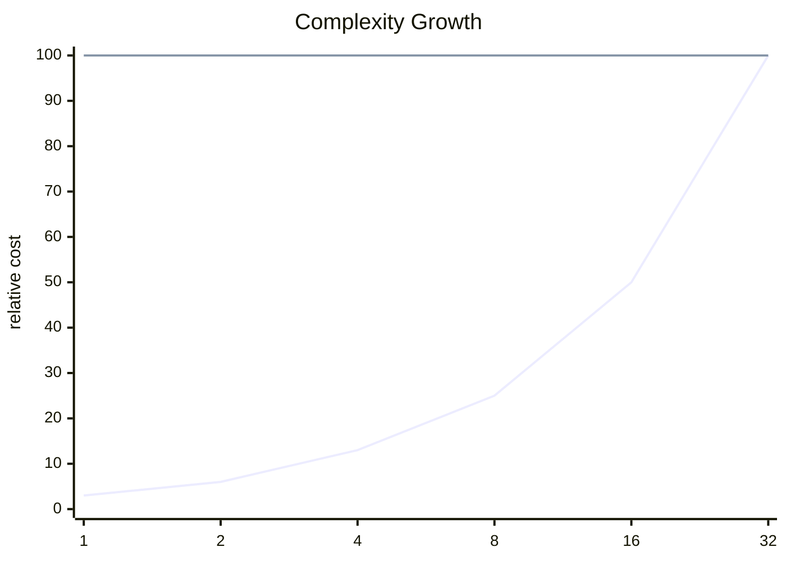

<h2><a href="https://leetcode.com/problems/valid-parentheses-litcode-demo">Valid Parentheses</a></h2> <hr><div align="center">

# Valid Parentheses

<sub>A clean accepted solution with the key tradeoffs surfaced up front.</sub>

[](https://leetcode.com/problems/valid-parentheses-litcode-demo)


</div>

## Snapshot

| Problem | Difficulty | Language | Runtime | Memory |
| --- | --- | --- | --- | --- |
| [Valid Parentheses](https://leetcode.com/problems/valid-parentheses-litcode-demo) | Easy | Python3 | 1 ms | 16.4 MB |

## Intuition

> The solution follows the direct shape of the problem and keeps the implementation close to the required transformation.

## Approach

1. Read the relevant input state.
2. Apply the core transformation or lookup logic.
3. Return the result in the format expected by the judge.

## Execution Trace

The code moves from input inspection to the core transformation and returns as soon as the target condition is satisfied.

**Scenario:** Representative sample input

| Step | Action | State |
| --- | --- | --- |
| 1 | Read input | Initial state prepared |
| 2 | Apply core logic | State changes according to the submitted code |
| 3 | Return result | Output matches required format |

## Complexity

<sub>Normalized growth curve. Lower and flatter is better.</sub>



| Metric | Big-O | Tier |
| --- | --- | --- |
| **Time** | `O(n)` | Good |
| **Space** | `O(1)` | Excellent |

<details>
<summary>Complexity notes</summary>

| Metric | Explanation |
| --- | --- |
| **Time** | The submitted code appears to scan the input once. |
| **Space** | Only a constant amount of extra state is apparent from the submitted code. |

</details>

## Checks

- Smallest valid input
- Boundary values
- Inputs that trigger carry or empty-result behavior

<details>
<summary>Problem statement</summary>

## Problem Statement

Given a string `s` containing just parentheses characters, determine if the input string is valid. Open brackets must be closed by the same type and in the correct order.

</details>

## Code

```py
class Solution:
    def isValid(self, s: str) -> bool:
        stack = []
        pairs = {")": "(", "]": "[", "}": "{"}

        for char in s:
            if char in pairs.values():
                stack.append(char)
            elif not stack or stack.pop() != pairs[char]:
                return False

        return not stack
```

---

<div align="center">
<sub>Generated by <strong>LitCode</strong></sub>
</div>
