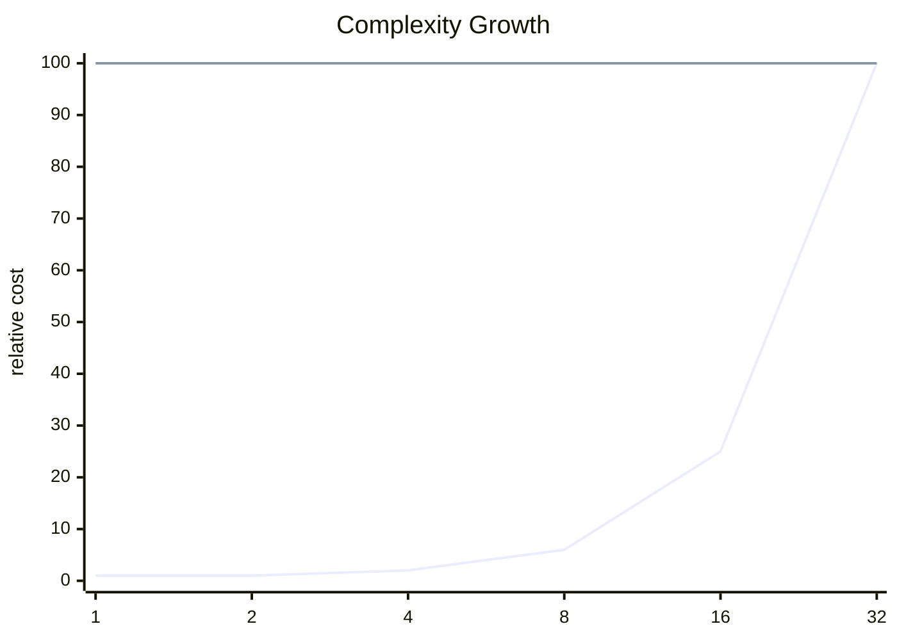

<h2><a href="https://leetcode.com/problems/count-the-number-of-special-characters-ii">Count the Number of Special Characters II</a></h2> <hr><div align="center">

# Count the Number of Special Characters II

<sub>A clean accepted solution with the key tradeoffs surfaced up front.</sub>

[](https://leetcode.com/problems/count-the-number-of-special-characters-ii)


</div>

## Snapshot

| Problem | Difficulty | Language | Runtime | Memory |
| --- | --- | --- | --- | --- |
| [Count the Number of Special Characters II](https://leetcode.com/problems/count-the-number-of-special-characters-ii) | Medium | Java | 9 ms | 48.1 MB |

## Intuition

> The solution follows the direct shape of the problem and keeps the implementation close to the required transformation.

## Approach

1. Read the relevant input state.
2. Apply the core transformation or lookup logic.
3. Return the result in the format expected by the judge.

## Execution Trace

The code moves from input inspection to the core transformation and returns as soon as the target condition is satisfied.

**Scenario:** Representative sample input

| Step | Action | State |
| --- | --- | --- |
| 1 | Read input | Initial state prepared |
| 2 | Apply core logic | State changes according to the submitted code |
| 3 | Return result | Output matches required format |

## Complexity

<sub>Normalized growth curve. Lower and flatter is better.</sub>



| Metric | Big-O | Tier |
| --- | --- | --- |
| **Time** | `O(n^2)` | Heavy |
| **Space** | `O(1)` | Excellent |

<details>
<summary>Complexity notes</summary>

| Metric | Explanation |
| --- | --- |
| **Time** | The submitted code contains multiple loops, so review nesting to confirm the exact bound. |
| **Space** | Only a constant amount of extra state is apparent from the submitted code. |

</details>

## Checks

- Smallest valid input
- Boundary values
- Inputs that trigger carry or empty-result behavior

<details>
<summary>Problem statement</summary>

## Problem Statement

You are given a string `word`. A letter `c` is called **special** if it appears **both** in lowercase and uppercase in `word`, and **every** lowercase occurrence of `c` appears before the **first** uppercase occurrence of `c`.

 Return the number of* ***special** letters* *in* *`word`.

 Example 1:**

 **Input:** word = "aaAbcBC"

 **Output:** 3

 **Explanation:**

 The special characters are `'a'`, `'b'`, and `'c'`.

 Example 2:**

 **Input:** word = "abc"

 **Output:** 0

 **Explanation:**

 There are no special characters in `word`.

 Example 3:**

 **Input:** word = "AbBCab"

 **Output:** 0

 **Explanation:**

 There are no special characters in `word`.

 **Constraints:**

- `1 5 `

- `word` consists of only lowercase and uppercase English letters.

</details>

## Code

```java
class Solution {
    public int numberOfSpecialChars(String word) {
        int lower[] = new int[26];
        int upper[] = new int[26];
        Arrays.fill(lower, -1);
        Arrays.fill(upper, -1);
        for(int i = 0 ; i < word.length(); i++){
            char cha = word.charAt(i);
            if(cha >= 'a' && cha<='z'){
                lower[cha-'a'] = i;
            }else{
                if(upper[cha-'A']== -1){
                    upper[cha-'A'] = i;
                }
            }
        }
        int count = 0;
        for(int i = 0; i < 26; i++){
            if(lower[i] != -1 && upper[i] != -1 && lower[i] < upper[i]){
                count++;
            }
        }
        return count;
    }
}
```

---

<div align="center">
<sub>Generated by <strong>LitCode</strong></sub>
</div>
