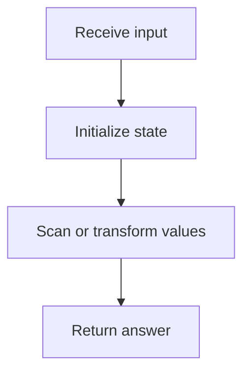
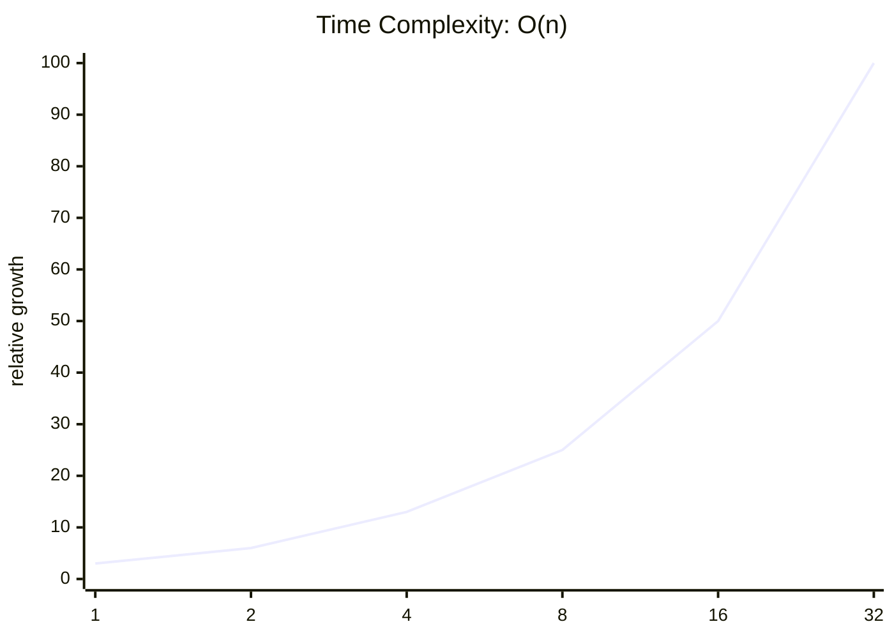

<h2><a href="https://leetcode.com/problems/plus-one-litcode-demo">Plus One</a></h2> <hr><div align="center">

# Plus One

A clean accepted solution with the key tradeoffs surfaced up front.

[](https://leetcode.com/problems/plus-one-litcode-demo)


</div>

## At a Glance

|  |  |
| --- | --- |
| **Problem** | [Plus One](https://leetcode.com/problems/plus-one-litcode-demo) |
| **Difficulty** | Easy |
| **Language** | Java |
| **Runtime** | 0 ms |
| **Memory** | 41.9 MB |

## Intuition

> The solution follows the direct shape of the problem and keeps the implementation close to the required transformation.

## Approach

1. Read the relevant input state.
2. Apply the core transformation or lookup logic.
3. Return the result in the format expected by the judge.

## Code Visualization

The code moves from input inspection to the core transformation and returns as soon as the target condition is satisfied.



### Dry Run

**Scenario:** Representative sample input

| Step | Action | State |
| --- | --- | --- |
| 1 | Read input | Initial state prepared |
| 2 | Apply core logic | State changes according to the submitted code |
| 3 | Return result | Output matches required format |

## Complexity

### Complexity Curves

These curves show how work grows as input size increases. The values are normalized so the shape is easy to compare, like a lightweight LeetCode-style complexity graph.



```mermaid
xychart-beta
    title "Space Complexity: O(1)"
    x-axis [1, 2, 4, 8, 16, 32]
    y-axis "relative growth" 0 --> 100
    line [100, 100, 100, 100, 100, 100]
```

| Metric | Big-O | Tier |
| --- | --- | --- |
| **Time** | `O(n)` | Good |
| **Space** | `O(1)` | Excellent |

### Complexity Notes

| Metric | Explanation |
| --- | --- |
| **Time** | The submitted code appears to scan the input once. |
| **Space** | Only a constant amount of extra state is apparent from the submitted code. |

## Edge Cases

- Smallest valid input
- Boundary values
- Inputs that trigger carry or empty-result behavior

## Problem Statement

<details>
<summary>View cleaned problem statement</summary>

You are given a large integer represented as an integer array `digits`. Increment the large integer by one and return the resulting array of digits.

</details>

## Submitted Code

```java
class Solution {
    public int[] plusOne(int[] digits) {
        for (int i = digits.length - 1; i >= 0; i--) {
            if (digits[i] < 9) {
                digits[i]++;
                return digits;
            }
            digits[i] = 0;
        }

        int[] result = new int[digits.length + 1];
        result[0] = 1;
        return result;
    }
}
```

---

<div align="center">
Generated by <strong>LitCode</strong> — premium READMEs for LeetCode submissions.
</div>
