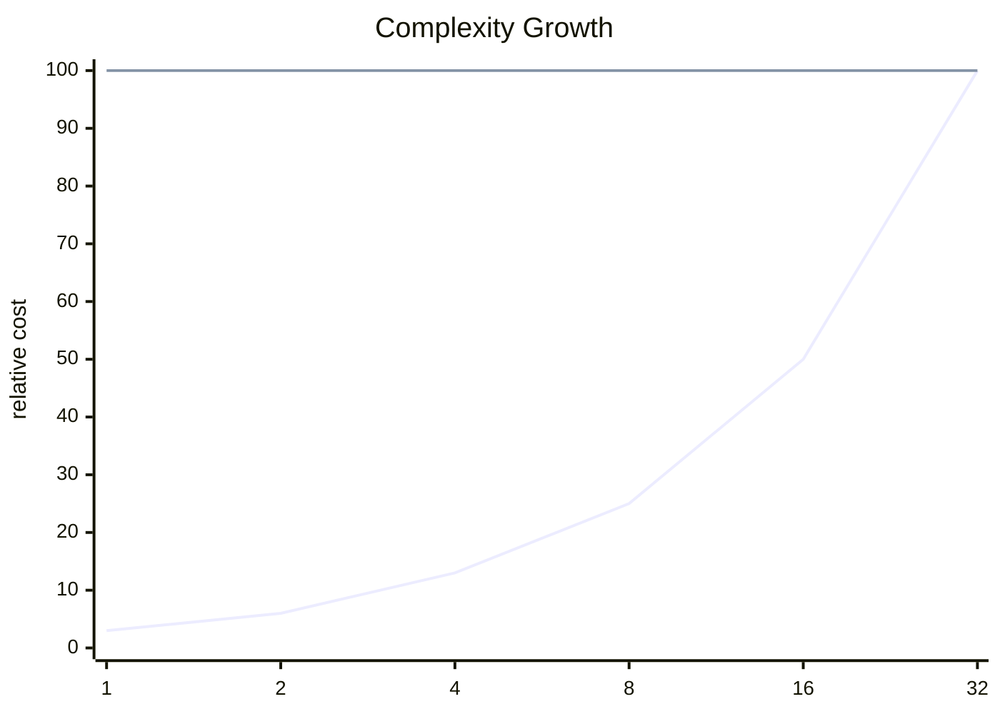

<h2><a href="https://leetcode.com/problems/remove-duplicates-from-sorted-array-ii">Remove Duplicates from Sorted Array II</a></h2> <hr><div align="center">

# Remove Duplicates from Sorted Array II

<sub>A clean accepted solution with the key tradeoffs surfaced up front.</sub>

[](https://leetcode.com/problems/remove-duplicates-from-sorted-array-ii)


</div>

## Snapshot

| Problem | Difficulty | Language | Runtime | Memory |
| --- | --- | --- | --- | --- |
| [Remove Duplicates from Sorted Array II](https://leetcode.com/problems/remove-duplicates-from-sorted-array-ii) | Medium | Java | 1 ms | 48.3 MB |

## Intuition

> The solution follows the direct shape of the problem and keeps the implementation close to the required transformation.

## Approach

1. Read the relevant input state.
2. Apply the core transformation or lookup logic.
3. Return the result in the format expected by the judge.

## Execution Trace

The code moves from input inspection to the core transformation and returns as soon as the target condition is satisfied.

**Scenario:** Representative sample input

| Step | Action | State |
| --- | --- | --- |
| 1 | Read input | Initial state prepared |
| 2 | Apply core logic | State changes according to the submitted code |
| 3 | Return result | Output matches required format |

## Complexity

<sub>Normalized growth curve. Lower and flatter is better.</sub>



| Metric | Big-O | Tier |
| --- | --- | --- |
| **Time** | `O(n)` | Good |
| **Space** | `O(1)` | Excellent |

<details>
<summary>Complexity notes</summary>

| Metric | Explanation |
| --- | --- |
| **Time** | The submitted code appears to scan the input once. |
| **Space** | Only a constant amount of extra state is apparent from the submitted code. |

</details>

## Checks

- Smallest valid input
- Boundary values
- Inputs that trigger carry or empty-result behavior

<details>
<summary>Problem statement</summary>

## Problem Statement

Given an integer array `nums` sorted in **non-decreasing order**, remove some duplicates **in-place** such that each unique element appears **at most twice**. The **relative order** of the elements should be kept the **same**.

 Since it is impossible to change the length of the array in some languages, you must instead have the result be placed in the **first part** of the array `nums`. More formally, if there are `k` elements after removing the duplicates, then the first `k` elements of `nums` should hold the final result. It does not matter what you leave beyond the first `k` elements.

 Return `k`* after placing the final result in the first *`k`* slots of *`nums`.

 Do **not** allocate extra space for another array. You must do this by **modifying the input array in-place ** with O(1) extra memory.

 **Custom Judge:**

 The judge will test your solution with the following code:

```text

int[] nums = [...]; // Input array
int[] expectedNums = [...]; // The expected answer with correct length

int k = removeDuplicates(nums); // Calls your implementation

assert k == expectedNums.length;
for (int i = 0; i If all assertions pass, then your solution will be **accepted**.

 Example 1:**

```text

**Input:** nums = [1,1,1,2,2,3]
**Output:** 5, nums = [1,1,2,2,3,_]
**Explanation:** Your function should return k = 5, with the first five elements of nums being 1, 1, 2, 2 and 3 respectively.
It does not matter what you leave beyond the returned k (hence they are underscores).

```

 Example 2:**

```text

**Input:** nums = [0,0,1,1,1,1,2,3,3]
**Output:** 7, nums = [0,0,1,1,2,3,3,_,_]
**Explanation:** Your function should return k = 7, with the first seven elements of nums being 0, 0, 1, 1, 2, 3 and 3 respectively.
It does not matter what you leave beyond the returned k (hence they are underscores).

```

 **Constraints:**

- `1 4 `

- `-10 4 4 `

- `nums` is sorted in **non-decreasing** order.

</details>

## Code

```java
class Solution {
    public int removeDuplicates(int[] nums) {
        int count = 0;
        int i = 1;
        int j = 1;

        while (i < nums.length) {
            if (nums[i] == nums[i - 1]) {
                count++;
            } else {
                count = 0;
            }

            if (count < 2) {
                nums[j] = nums[i];
                j++;
            }

            i++;
        }

        return j;
    }
}
```

---

<div align="center">
<sub>Generated by <strong>LitCode</strong></sub>
</div>
